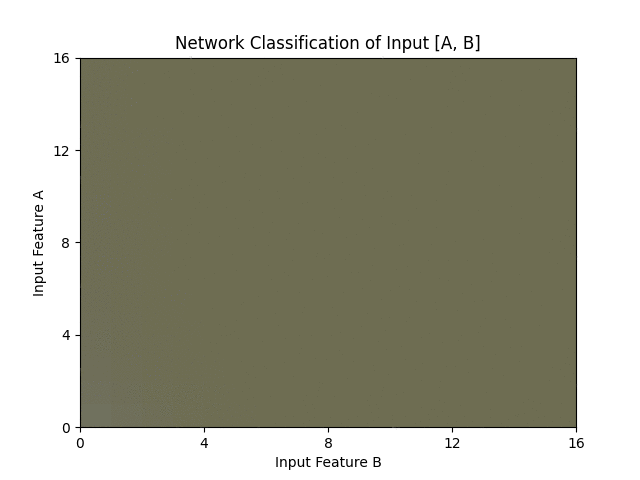
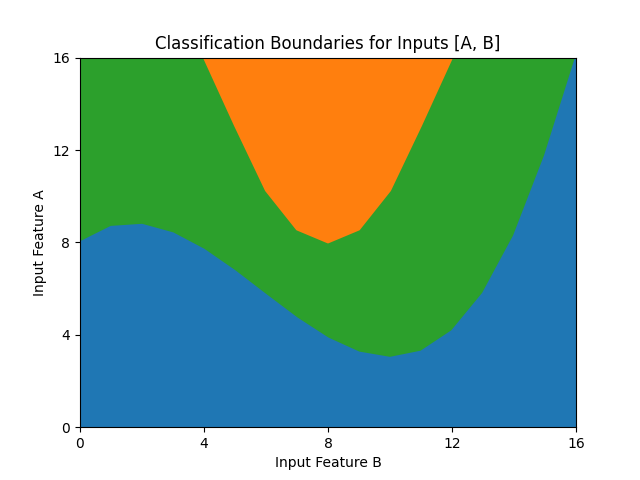
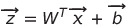
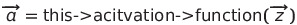
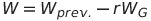
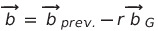
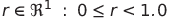

# MLSandbox
## A Collection of Neural Network Primitives and Generic Models Written in C++




## Summary:

Basic neural networks implemented with an emphasis on modularity. This project was undertaken after a few years of experience in developing and training abstracted ML models (e.g. Python libs / APIs), and serves to foster a deeper understanding of network elements and training behavior. 

<br>

- - -

### Some Noteworthy Points on Design Philosophy

#### 1. Interfacing and Abstraction
Feeding sample features to a model or assigning parameters should be as discrete as possible, and prioritize interoperability. Network interfacing will generally avoid the use of classes or structs that wrap (and obfuscate) data. All models *and* network components should output a vector of activation values as an array of ordinary type, or, at most, a scalar result derived with minimal complexity (e.g. a max or a min activation value within the prediction vector). _The general aim of these models is explicit interfacing with primitive blocks and data structures, as opposed to abstracting them for brevity_.

#### 2. Use of Templates
Models, network components, and primitives implement a universal generic denoted **fp** (for "floating point") through the use of hierarchical templates. Precision and performance of a model are largely defined by the representation of the floating point values therein, and specific applications will often warrant the use of a long double over a float, etc.

#### 3. Dependencies
None, as non-STL libraries (with the _possible_ exception of parallelizing libs) are avoided entirely. It's worth noting that many network demos in this repo will include custom headers for importing data. This minimizes distraction from network-specific code blocks in the demo program, and all reads are cast as ordinary arrays before being fed into a network. I've also made the repo of each custom import header public for ease of debugging / convenience / reference etc.

#### 4. Project Road Map

- [X] Generic templates and common primitives (activation functions, gradients, etc.)

- [X] Basic, fully-connected, feed-forward nnet as proof of concept for modular network components

- [X] Demo of basic classification with a deep network; e.g. fitting points within boundary functions

- [ ] Network components optimized for convolutional neural networks (CNNs)

- [ ] Demo(s) of feature-extraction, pooling, and classification with the MNIST set and an ordinary CNN

- [ ] Network components that enable simple implementations of transformers
  
- [ ] Demo of "attention" in the context of natural language processing

- [ ] Parallelization templates (likely using OpenMPI) for high-throughput feature-processing applications

- - -
## Network Topologies and Primitive Structures in nnet \{ }

> #### Topologies:
>    1. Fully-Connected Neural Network
>    2. Convolutional Neural Network
>
> #### Components:
>    1. Activation Object
>    2. Fully-Connected Layer
>       2a. Weights and Biases
>       2b. Gradient
>    3. Convolutional Layer
>       3a. 


- - -

## Topologies:

## 1. Standard Network

#### Constructors:

```cpp
// (1) Pass a list of layer definitions to build a new network for training. 

// This builds a "full" network with gradients, save buffers, etc.
nnet::Network(const std::vector<layer_t> layerCfg);
```


```cpp
// (2) Pass a file-path to recall trained network layers.

// File header specifies creation of a "sparse" network with only weights
// and biases for a static model, or a full network for further training.
nnet::Network(const std::string filePath);
```

<br>

#### Examples:

```cpp
// (1) See above.

// A Network's first layer has no activation function, and
// the type specified is arbitrary as it's always dicarded
const auto layers = {

    (nnet::layer_t){ 2, nnet::ActivationTypes::none     },
    (nnet::layer_t){ 3, nnet::ActivationTypes::sigmoid  },
    (nnet::layer_t){ 3, nnet::ActivationTypes::sigmoid  } 

}

auto demoDNN = new nnet::Network<float>(layers);
```
```cpp
// (2) See above.

auto classifier = new nnet::Network<double>(IRIS_CLASSIFIER_PATH);

auto label = classifier->predict(sample);
```

<br>

#### Notes:

<br>

## 2. Convolutional Network

#### Constructors:
<br>

#### Examples:

```cpp
// An instance of conv_layer_t describes a convolutional layer object for the network constructor with:
// { N-dimensional vector describing convolution kernel, conv. activation function, pooling function }
// The actual convolutional layer class, nnet::ConvolutionalLayer, handles convolution and pooling.
const auto cpLayers = {

    (nnet::conv_layer_t){ {6, 5, 5}, nnet::ActivationTypes::relu, nnet::PoolingTypes::maxPool },
    (nnet::conv_layer_t){ {6, 5, 5}, nnet::ActivationTypes::relu, nnet::PoolingTypes::maxPool },

};

// Fully connected layers that handle classification.
const auto fcLayers = {

    (nnet::layer_t){ 2, nnet::ActivationTypes::relu    },
    (nnet::layer_t){ 3, nnet::ActivationTypes::sigmoid },
    (nnet::layer_t){ 5, nnet::ActivationTypes::sigmoid },
    (nnet::layer_t){ 3, nnet::ActivationTypes::sigmoid }

};

auto classifier = new nnet::ConvolutionalNetwork<float>(cpLayers, fcLayers);
```

<br>

#### Constructors:
<br>

#### Notes:

- - -

# Components

## 1. "Standard" Gradient-Paired Layer

#### Constructors:

```cpp
nnet::Layer(const size_t inp, const size_t out, const ActivationTypes afn);
```

<br>

#### Examples:

| Symbol   | Dim.  | Description            | Stored in Sparse Network |
|----------|-------|------------------------|--------------------------|
| **W**    | m, n  | Weights                | Yes
| **b**    | m, 1  | Biases                 | Yes
| **x**    | n, 1  | Input Vector           | No
| **z**    | m, 1  | Weighted Inp. Vector   | TBD
| **a**    | m, 1  | Activations (Output)   | Yes
| **e**    | m, 1  | Label / Expected Output| No
| **W~G~** | m, n  | Gradient Weights       | No
| **b~G~** | m, 1  | Gradient Biases        | No
| **D~BP~**| m, 1  | Back-Prop. Buffer      | No

Given a "full" layer with dimensions *n* and *m* (input and output size, respectively), 
the following methods describe the relationship of the member data above:

<br>

```cpp
fp * evaluate(const fp * input);
```
1.   
2.  
- returns pointer to newly updated array **a** for layer chaining in feed(sample) etc.

<br>

```cpp
void applyGradient(const fp learnRate);
```
1.  
2.  
- for "learn rate", *r*, given: 

<br>

```cpp
void updateOutputCostDerivative(const fp * label);
```

<br>

```cpp
void updateHiddenLayerCostDerivative(Layer<fp> * lastLayer);
```

<br>

```cpp
void applyDerivativeVector(void);
```

<br>

## 2. Kernel-Paired Layer

#### Constructors:

```cpp
// (1) This layer and its corresponding kernel are restricted to squares. 
//     Hence, the constructor expects only two arguments 
nnet::AddMePl0x(const size_t layerSize, const size_t kernelSize);
```

<br>

#### Examples:

```cpp

```
