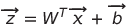

# Network Topologies and Primitive Structures in nnet \{ }
### Explanation of Design Choices Through Practical Examples

- - -

#### Notes:

##### a. Use of Templates

The **Network** class and its members implement a universal generic denoted **fp** (for "floating point") through the use of heirarchical templates. Precision and performance of a model are largely defined by the representation of the floating point values therein, and specific applications will often warrant the use of a long double over a float, etc.

- - -
# Networks:

## I. Classic Neural Network

#### Constructors:

```cpp
// (1) Pass a list of layer definitions to build a new network for training. 

// This builds a "full" network with gradients, save buffers, etc.
nnet::Network(const std::vector<layer_t> layerCfg);
```


```cpp
// (2) Pass a file-path to recall trained network layers.

// File header specifies creation of a "sparse" network with only weights
// and biases for a static model, or a full network for further training.
nnet::Network(const std::string filePath);
```

#### Examples:

```cpp
// (1) See above.

// A Network's first layer has no activation function, and
// the type specified is arbitrary as it's always dicarded
const auto layers = {

    (nnet::layer_t){ 2, nnet::ActivationTypes::none     },
    (nnet::layer_t){ 3, nnet::ActivationTypes::sigmoid  },
    (nnet::layer_t){ 3, nnet::ActivationTypes::sigmoid  } 

}

auto demoDNN = new nnet::Network<float>(layers);
```
```cpp
// (2) See above.

auto classifier = new nnet::Network<double>(IRIS_CLASSIFIER_PATH);

auto label = classifier->predict(sample);
```

#### Notes on Structure:


## II. Layer

#### Constructors:

```cpp
nnet::Layer(const size_t inp, const size_t out, const ActivationTypes afn);
```

#### Examples:
```cpp
```

#### Notes on Structure:

Given a "full" layer with the following members:

| Symbol | Dim.  | Description |
|--------|-------|-------------|
| **W**  |[m x n]| Weights     |
| **b**  |[m x 1]| Biases      |
| **x**  |[n x 1]| Input Vector|
| **z**  |[m x 1]| Weighted Inp|
| **a**  |[m x 1]| Activations |


