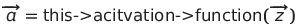
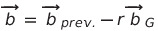

# Network Topologies and Primitive Structures in nnet \{ }
### Explanation of Design Choices Through Practical Examples

- - -

#### Notes:

##### a. Use of Templates

The **Network** class and its members implement a universal generic denoted **fp** (for "floating point") through the use of heirarchical templates. Precision and performance of a model are largely defined by the representation of the floating point values therein, and specific applications will often warrant the use of a long double over a float, etc.

- - -
# Topologies:

## I. Standard Network

#### Constructors:

```cpp
// (1) Pass a list of layer definitions to build a new network for training. 

// This builds a "full" network with gradients, save buffers, etc.
nnet::Network(const std::vector<layer_t> layerCfg);
```


```cpp
// (2) Pass a file-path to recall trained network layers.

// File header specifies creation of a "sparse" network with only weights
// and biases for a static model, or a full network for further training.
nnet::Network(const std::string filePath);
```

<br>

#### Examples:

```cpp
// (1) See above.

// A Network's first layer has no activation function, and
// the type specified is arbitrary as it's always dicarded
const auto layers = {

    (nnet::layer_t){ 2, nnet::ActivationTypes::none     },
    (nnet::layer_t){ 3, nnet::ActivationTypes::sigmoid  },
    (nnet::layer_t){ 3, nnet::ActivationTypes::sigmoid  } 

}

auto demoDNN = new nnet::Network<float>(layers);
```
```cpp
// (2) See above.

auto classifier = new nnet::Network<double>(IRIS_CLASSIFIER_PATH);

auto label = classifier->predict(sample);
```

<br>

#### Notes on Structure:

<br>

- - -

# Modules

## I. Standard Layer

#### Constructors:

```cpp
nnet::Layer(const size_t inp, const size_t out, const ActivationTypes afn);
```

<br>

#### Examples:

| Symbol   | Dim.  | Description            | Stored in Sparse Network |
|----------|-------|------------------------|--------------------------|
| **W**    |[m x n]| Weights                | Yes
| **b**    |[m x 1]| Biases                 | Yes
| **x**    |[n x 1]| Input Vector           | No
| **z**    |[m x 1]| Weighted Inp. Vector   | TBD
| **a**    |[m x 1]| Activations (Output)   | Yes
| **e**    |[m x 1]| Label / Expected Output| No
| **W~G~** |[m x n]| Gradient Weights       | No
| **b~G~** |[m x 1]| Gradient Biases        | No
| **D~BP~**|[m x 1]| Back-Prop. Buffer      | No

Given a "full" layer with dimensions *n* and *m* (input and output size, respectively), 
the following methods describe the relationship of the member data above:

<br>

```cpp
fp * evaluate(const fp * input);
```
1.   
2.  
- returns pointer to newly updated array **a** for layer chaining in feed(sample) etc.

<br>

```cpp
void applyGradient(const fp learnRate);
```
1.  
2.  
- for "learn rate", *r*, given: 

<br>

```cpp
void updateOutputCostDerivative(const fp * label);
```

<br>

```cpp
void updateHiddenLayerCostDerivative(Layer<fp> * lastLayer);
```

<br>

```cpp
void applyDerivativeVector(void);
```